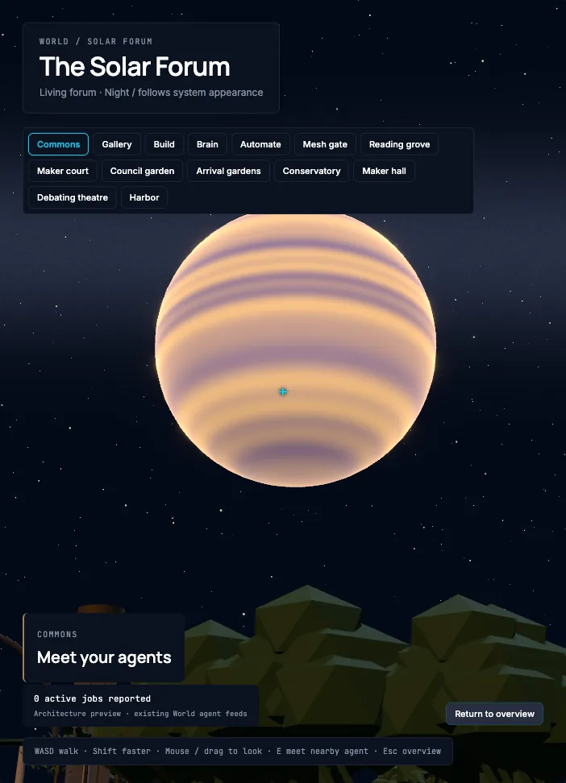
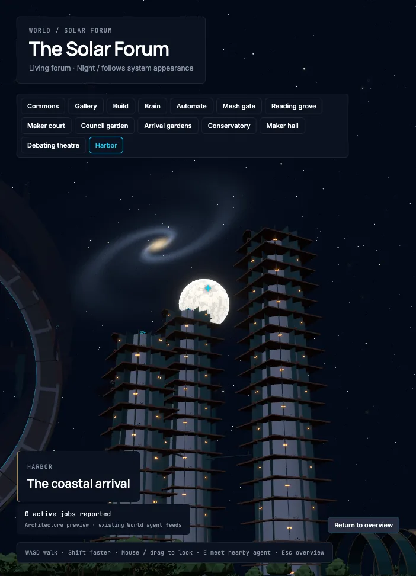
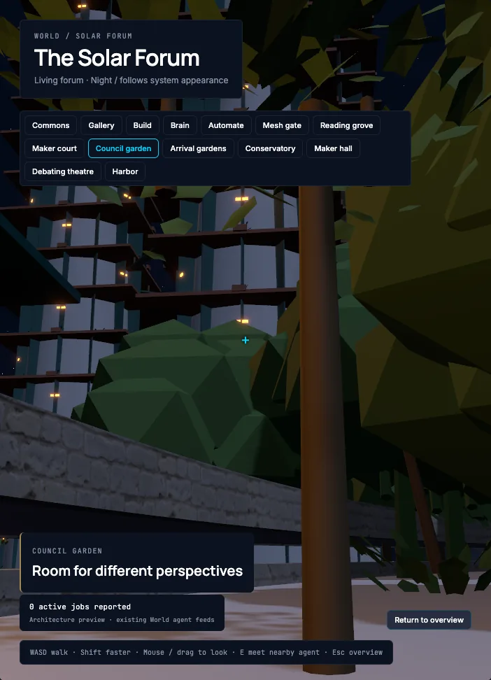
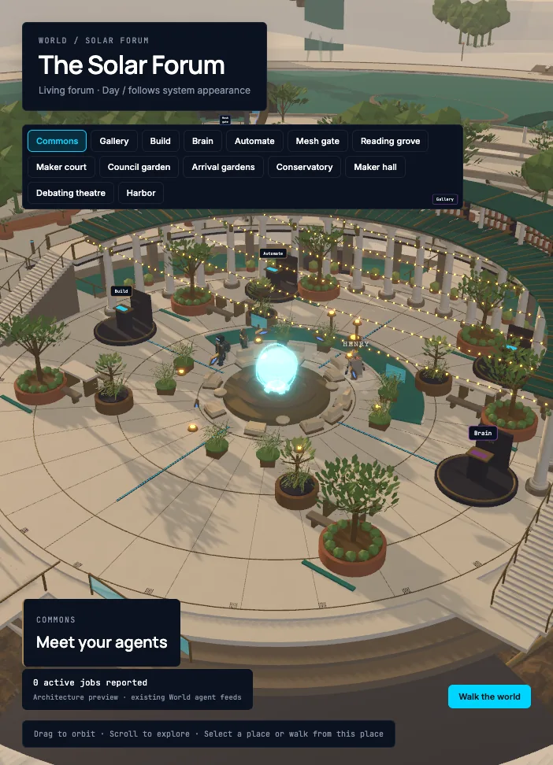
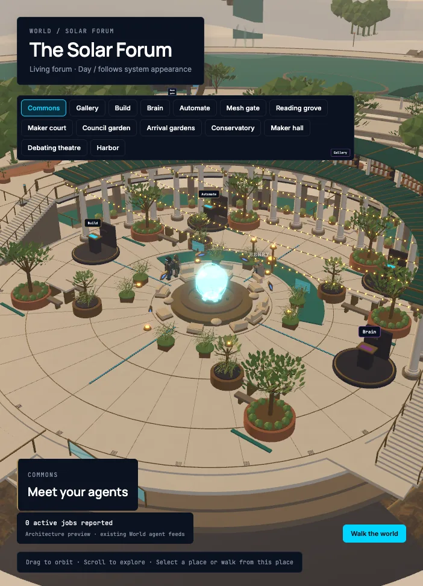

# Night re-check of the sky, window and shadow fixes (v3)

Date: 2026-09-15. Branch: `feat/solarpunk-forum` (clone `recovery/solar-forum`),
HEAD `b3b6afe1`, clean at the start of the run.

Job 18 (`jobs/18-in-app-verification-v2.md`) ended with a section titled
**"Fixes after v2 verification"** listing five things that only a real GPU run
could close: celestial contrast, occlusion, starfield punch-through, the shadow
deprecation warnings, and frame cost. This pass runs them in the real Command
Center app against the live local daemon, on the new export
(`FORUM_ASSET_REVISION = 64e14660b1c608c6`,
`ui/command-center/public/world/solar-forum.glb`, 14,425,300 bytes, sha-256
`64e14660b1c608c6…`), and adds the tower/habitat window strips the same commit
introduced.

Nothing was renamed, registered, approved or configured. **No chat message was
sent to the daemon this time** — job 18 bug 2 (the reply backend on
`127.0.0.1:8081`) is unchanged, and the task excluded it. No file under
`ui/command-center/src` was changed; the bugs found there are reported below,
not fixed.

## Commands run

```text
# 1. dev server (from ui/command-center), stopped at the end of this job
npm run dev -- --host 127.0.0.1 --port 5284

# 2. job 18's harness, the gates that had to stay comparable (from ui/command-center)
GATES=load,mesh,night node scripts/verify-world-in-app-v2.mjs

# 3. the checks job 18 left open (from ui/command-center)
node scripts/verify-world-night-v3.mjs
GATES=sky node scripts/verify-world-night-v3.mjs        # subset form (merges)

# 4. evidence shrink (PNG -> WebP, doc links rewritten), from the clone root
python3 scripts/blender/shrink-evidence.py
```

Environment, identical in kind to job 18 so the numbers compare: Google Chrome
**152.0.7977.83** headless via Playwright `channel: 'chrome'`, ANGLE Metal on an
Apple M4, WebGL 2.0, `--disable-frame-rate-limit --disable-gpu-vsync`, viewport
1280 × 1000, forum canvas 702 × 972 at dpr 1, daemon `127.0.0.1:3001`
(`GET /status` 200). The daemon token is read from
`~/.permagent/secrets/daemon_token.json` and never printed or written.

New files (harness and evidence only):

- `ui/command-center/scripts/verify-world-night-v3.mjs`
- `docs/design/solar-forum/night-recheck-v3.json`
- `docs/design/solar-forum/in-app-report-v2-rerun-job19.json` (copy of this
  run's v2-harness record; the harness itself overwrites
  `docs/design/solar-forum/in-app-report-v2.json` in place, so job 18's
  committed numbers are recovered with
  `git show b3b6afe1:docs/design/solar-forum/in-app-report-v2.json`)
- `assets/world/forum/browser/v3-*.webp` (written as PNG, shrunk by step 4)

Re-running the v2 harness also **overwrites job 18's own evidence in place**:
`assets/world/forum/browser/v2-*.webp` are now this run's frames, not job 18's,
and `docs/design/solar-forum/in-app-report-v2.json` is this run's record. Both
sets of job-18 originals are still in git at `b3b6afe1`.

One fix was made to `ui/command-center/scripts/verify-world-in-app-v2.mjs`
(harness, not `src/`): its hard-coded gas-giant position had gone stale and
would have aimed the night gate at the wrong half of the sky. Written up as
bug 6 below.

## Results

| # | Check | Result | Evidence |
| --- | --- | --- | --- |
| 1 | Moon reads against the sky at **night**, commons overlook (beat 0.82) | **PASS** | contrast **13.17** (median 15.99): disc 232.6 against a 17.7 sky · `v3-commons-overlook-moon-night.webp` |
| 1 | Gas giant at **night**, commons overlook (beat 1.09) | **PASS** | contrast **7.34** (median 10.62): disc 163.9 against 22.4 · `v3-commons-overlook-gasGiant-night.webp` |
| 1 | Moon at **night**, gate approach | **PASS** | contrast **10.51** (median 17.16) · `v3-gate-approach-moon-night.webp` |
| 1 | Gas giant at **night**, gate approach (beat 0.70) | **PASS (occluded, by design)** | contrast 1.11 — and 86 % of the disc's light is blocked by the ridge: 23.5 → **164.2** with the world hidden · `v3-occlude-mesh-gate-gasGiant{,-noworld}.webp` |
| 1 | Moon and gas giant at **night**, harbour | **PASS** | moon **7.93**, gas giant **7.63** · `v3-harbour-moon-night.webp`, `v3-harbour-gasGiant-night.webp` |
| 1 | Both bodies in **day**, all three vantages | **FAIL on the metric, PASS on the eye** | luma ratio 0.98–1.16 (median ratio down to 0.74) — the day sky is as bright as the bodies. The gas giant is nonetheless plainly drawn: disc 135.8–244.1 of banded structure against a flat 233 sky · `v3-commons-overlook-gasGiant-day.webp`. See bug 1 |
| 1 | Real geometry still occludes a body when it should | **PASS** | world-hidden comparison: Maker hall (under the roof) gas giant **94 %** blocked, Conservatory **95 %**, Mesh gate **86 %**, harbour moon **19 %** partially cut by a tower, commons **0 %** · `v3-occlude-*.webp` |
| 1 | No stars punch through the moon's disc | **PASS** | commons overlook night frame: **0** isolated spikes in 3,644 disc pixels (max excess 21.9, below the 35 threshold) against **207** spikes in 29,996 sky-annulus pixels (max excess 221.4) |
| 2 | `prefers-color-scheme: dark` still gives the night scene | **PASS** | `Night / follows system appearance`, canvas RGB variance 3,971 · `v3-world-night.webp` |
| 2 | Tower/habitat window strips exist in the export | **PASS** | one mesh, **4,056 vertices = 169 boxes in 28 clusters** (was 5 boxes / 120 vertices in job 18) — spires at x 69…122, z −44…−86, y 6…109; habitats and market hall at x −95…−113, z ≈ +30 |
| 2 | Window strips read as lit **from the commons overlook** | **FAIL (not in frame)** | **0 of 4,056** vertices project into the overview camera's frustum; nearest cluster 102 m away. See bug 4 |
| 2 | Window strips read as lit **from a garden vantage** | **PASS** | Council garden, walk mode: 23 of 28 clusters visible, 2,916 vertices in frame; at night 287 px ≥ 160 luma in an architecture band whose mean is **35.2**, versus 0 px brighter-at-night — they hold their radiance while everything else drops · `v3-windows-council-garden-night.webp`, `v3-tower-windows-night.webp` |
| 2 | "Emissive pixels brighter at night", as in v2 | **N/A for the strips** | **0** of 2,916 (Council garden), 672 (Arrival gardens), 228 (Maker hall) strip points is brighter at night, and **0** pixels in the architecture band exceed the +25 delta (max delta 11.4). The strips emit identically in day and night. See bug 5 |
| 3 | The 39 `PCFSoftShadowMap has been deprecated` lines are gone | **PASS** | **0** in the whole v2-harness run (load + mesh + night); job 18 recorded 39 |
| 3 | Shadows still render | **PASS** | live renderer reports `shadowMap.enabled true`, `type 1 (PCFShadowMap)`, 63 casting / 51 receiving meshes, 1 casting light; turning the pass off brightens **64,113 of 273,780** ground-band pixels (23.4 %) by mean +21.0, max +70.8 · `v3-shadows-on.webp` / `v3-shadows-off.webp` |
| 4 | FPS and draw calls, day and night, overview and walk | **PASS (measured)** | table below; within noise of job 18 |
| 5 | MESH walk-through regression | **PASS** | gate focus, outward ring crossing, Agora plaque, Escape return, all as job 18 |

### 1. The sky, day and night, from one camera

The day and night frames in every row below are the **same camera**:
`useSystemAppearance.ts` is a `useSyncExternalStore` over a `matchMedia`
subscription, so `page.emulateMedia({ colorScheme })` flips the scene live with
no reload. The recorded camera displacement between each pair is **0.000 m**.

| vantage | body | day disc / sky | day ratio | night disc / sky | night ratio |
| --- | --- | --- | --- | --- | --- |
| commons overlook `(0, 1.7, 14)` | moon | 233.4 / 204.4 | 1.14 | 232.6 / 17.7 | **13.17** |
| commons overlook | gas giant | 172.9 / 174.9 | 0.98 | 163.9 / 22.4 | **7.34** |
| gate approach `(-35.355, 1.7, -35.355)` | moon | 246.3 / 212.8 | 1.16 | 228.9 / 21.7 | **10.51** |
| gate approach | gas giant | 51.5 / 47.4 | 1.10 | 23.5 / 21.3 | 1.11 (ridge) |
| harbour `(2, 1.7, 123)` | moon | 212.5 / 191.4 | 1.11 | 186.5 / 23.5 | **7.93** |
| harbour | gas giant | 189.6 / 168.9 | 1.12 | 163.2 / 21.4 | **7.63** |

Job 18's numbers to beat were moon **0.82** and gas giant **0.70 / 1.09**. Every
unobstructed night reading now clears 7, and the moon clears 10. The disc
measurement excludes the 12-px radius around the canvas centre, because the
walk-mode crosshair sits exactly there (bug 3).

**Occlusion.** A raycast is not available on this export (bug 7), so occlusion
is measured instead by hiding every non-sky mesh from the live scene, taking the
same frame again, and putting the world back:

| from | body | as rendered | world hidden | blocked |
| --- | --- | --- | --- | --- |
| Maker hall, under the roof | gas giant | 10.3 | 163.5 | **94 %** |
| Conservatory | gas giant | 9.0 | 164.2 | **95 %** |
| Mesh gate approach | gas giant | 23.5 | 164.2 | **86 %** |
| Harbor | moon | 190.4 | 233.8 | **19 %** (a tower cuts the lower limb) |
| Commons | moon | 232.6 | 232.6 | 0 % |
| Commons | gas giant | 163.9 | 163.9 | 0 % |

So the depth-write change did not turn the bodies into an overlay: the ridge,
the Maker hall roof and a harbour tower all still stand in front of them. The
gate-approach gas-giant reading of 1.11 is that ridge, not a lighting failure —
`v3-gate-approach-gasGiant-night.webp` is a frame of landform with the planet
behind it. Partial occlusion is visible too: at the gate the ring's structure
cuts the moon's left limb (`v3-gate-approach-moon-night.webp`), and at the
harbour a tower cuts its lower left (`v3-harbour-moon-night.webp`).

Three rows in the occlusion gate (`Maker hall` / `Conservatory` / `Mesh gate`
moon) read 0 in both frames and are **not evidence of anything**: the
black-rectangle capture artifact of bug 2 landed on the moon's position in those
frames (`v3-occlude-maker-hall-moon-noworld.webp` shows it). An earlier clean
capture of the same pose gave Maker hall moon 0.96 → 233.2, i.e. 100 % blocked.

**Starfield.** The detector counts pixels at least 35 luma above the median of
their own 7 × 7 neighbourhood — which is what a 1–3 px star is and what the
moon's own shading is not. On the clean commons frame: **0 spikes inside the
disc**, 207 in the sky annulus around it. The annulus is the control; a detector
that found nothing there would prove nothing. The gate (17) and harbour (39)
discs do register spikes, and the screenshots show why — the gate ring and a
tower cross those discs, so the spikes are architecture, not stars.




### 2. Night, and the window strips

`v3-world-night.webp` is the commons overlook at night: the strand lights, the
lanterns, the hologram and the braziers all read as lit, and no celestial body
and no tower is in that frame.

The window strips the previous commit added are really there now. The material
`Forum Warm Window Emission` is one merged mesh of **4,056 vertices — 169 boxes
in 28 clusters** (job 18 measured 120 vertices / 5 boxes, all of them the market
hall). The clusters sit where `scripts/blender/forum_towers.py:361` and `:371`
place them: three NE spires at x 69…122, z −44…−86, up to y 109, and the market
habitats at x −95…−113, z ≈ +30.

From the commons overlook they are still not visible, and not because they are
unlit: `ForumNavigation.tsx:27` puts that camera at `(29, 29, 36)` looking at
`(0, 1, 0)` with fov 48 on a 702 × 972 canvas, i.e. a horizontal field of about
36°, and the nearest strip cluster is 102 m away and about 48° off that axis.
**Zero of 4,056 vertices project into the frame.** The claim "the window strips
read as lit from the commons overlook" therefore still cannot be made (bug 4).

From a garden vantage they read exactly as intended. Council garden, walk mode
at `(2, 1.7, -50)`, aimed at the nearest spire cluster: 23 of 28 clusters and
2,916 strip vertices in frame; the architecture band (y 0.30–0.76 of the canvas)
has mean luma **90.7 by day and 35.2 at night**, and at night still carries
**287 pixels at or above 160 luma and 192 at or above 200** (31,142 pixels clear
160 by day, so it is not that the band went dark and kept nothing) — the lit floors.
`v3-windows-council-garden-night.webp` and `v3-tower-windows-night.webp` show
the alternating lit floors up the spire.



What is **not** true is that those pixels are *brighter* at night. Not one of
the 2,916 sampled strip points, and not one pixel of the 313,794 in the
architecture band, is 25 luma brighter at night than by day (max delta 11.4).
The strips carry `emissiveIntensity` 3.325 in both appearances, so they emit the
same amount and it is the surroundings that fall away. v2's "count emissive
pixels brighter at night" measure returns 0 for this material by construction
(bug 5).

### 3. Shadows

```json
"shadowMap": { "enabled": true, "type": 1, "typeName": "PCFShadowMap",
               "shadowCastingMeshes": 63, "shadowReceivingMeshes": 51,
               "shadowCastingLights": 1 }
```

`ForumView.tsx:185` now passes `shadows={{ type: PCFShadowMap }}`, and the live
renderer confirms it. **Zero** `PCFSoftShadowMap has been deprecated` lines in
the whole v2-harness run, against 39 in job 18.

Shadows still do something: with the same camera, `gl.shadowMap.enabled` was set
to `false` (and every material recompiled), the frame retaken, and the setting
restored. The ground band brightens from mean 117.65 to 122.97, with **64,113
of 273,780 pixels (23.4 %)** at least 8 luma brighter, mean delta +21.0, max
+70.8. That is the shadow pass, measured rather than asserted.

|  |  |
| --- | --- |
| shadows on (as shipped) | shadow pass disabled, then restored |

### 4. Frame cost

Same method and same harness as job 18 (`samplePerf`, six one-second samples in
overview, five in walk), so these are directly comparable:

| | FPS median (job 19) | job 18 | draw calls (19 / 18) | triangles/frame |
| --- | --- | --- | --- | --- |
| Day, overview | 137.4 | 143.6 | 276 / 274 | 2,676,159 |
| Day, walk | 146.4 | 153.5 | 268 / 266 | 2,673,031 |
| Night, overview | **96.4** | 98.7 | 280 / 277 | 2,682,685 |
| Night, walk | **107.0** | 109.5 | 272 / 269 | 2,679,557 |

Night still costs about 30 % of the frame for four extra draw calls, i.e. the
bloom chain and the nine night point lights, unchanged. The load gate on its own
read 136.9 median / 276 calls, and the v3 run's night overview read 100.5 / 280
— so the run-to-run spread is a few FPS and nothing in this commit moved the
cost. The two extra draw calls per mode are the two celestial bodies, now
opaque; making them depth-writing was neutral, as hoped.

### 5. MESH walk-through regression

Unchanged from job 18, gate for gate:

```json
"walkerAtGateDistrictStart": { "feet": { "x": -35.355, "y": 0, "z": -35.355 },
  "gate": { "signedDistance": -6, "lateralOffset": 0, "polarRadius": 50 } }
"outwardWalk": { "stalled": false, "agoraOpened": true, "samples": 13 }
signedDistance: -5.529 -5.036 -4.522 -4.018 -3.510 -3.014 -2.532
                -2.041 -1.539 -1.045 -0.543 -0.036 +0.261
lateralOffset:  <= 0.051 m throughout   (ring radius 4.6 m)
feet.y:         0.038 -> 0.721 m        (the three-step dais)
"agora": { "plaqueText": "MESH: NOT CONNECTED", "plaqueState": "offline",
           "perf": { "fps": { "median": 331.4 }, "calls": 22, "triangles": 1807 } }
"escape": { "agoraStillOpen": false, "feet": { "x": -35.355, "y": 0, "z": -35.355 } }
"overviewPath": { "agoraOpenedByDistrictReselect": true, "returnedByButton": true }
```

Walk-mode perf at the gate: 166.1 FPS median, 248 calls, 2,575,767 triangles.
Evidence: `v2-mesh-district.webp`, `v2-mesh-approach.webp`, `v2-mesh-agora.webp`,
`v2-mesh-return.webp`.

## Console and network during the run

From the v2-harness run (load + mesh + night, one app boot per gate):

- **0** × `THREE.WebGLShadowMap: PCFSoftShadowMap has been deprecated` (39 in
  job 18) — the check this job exists to close.
- **0** console messages mentioning meshopt, `EXT_meshopt_compression` or
  `KHR_mesh_quantization`; the scene census reports 172 meshes and 931,512
  authored triangles decoded.
- **55 console errors**, every one `Failed to load resource … 404`, from three
  endpoints: `GET /api/coding-sessions/harness-runs` ×46 (polled),
  `GET /api/browser/history` ×6, `POST /api/browser/snapshot/{id}` ×3. Job-18
  condition, unchanged.
- **15** uncaught `Cannot read properties of undefined (reading
  'transformCallback')` (job-11 bug 1, unchanged).
- ~846 `GL_INVALID_FRAMEBUFFER_OPERATION … Attachment has zero size` warnings
  across four WebGL contexts while a panel is still 0 × 0 during mount; they
  stop once the panel is laid out. Same class as jobs 11 and 18.
- **3** × `THREE.Clock: This module has been deprecated. Please use THREE.Timer
  instead.` — pre-existing (job 18 recorded 4), not introduced here.
- No page error originates from a `world/forum/*` module.
- `GET /api/sessions/{id}/cost` → 500 was **not** seen this run, because no
  conversation was opened.

## Bugs and findings

**1 (P2, forum, day) — the bodies sit at the day sky's own luminance.** Measured
above: luma ratios 0.98–1.16 across three vantages, and median ratios as low as
**0.74** for the gas giant from the commons. This is not the job-18 defect
returning — the gas giant is unmistakable in `v3-commons-overlook-gasGiant-day.webp`,
with 135.8…244.1 of banded structure against a flat ~233 sky — but the
disc-versus-surround ratio the job-18 fix was aimed at is a night measure, and
it does not carry in day. If a day reading above 1 is wanted, it has to come
from the body being *darker* or *more saturated* than the sunrise sky rather
than brighter: the floors are `ForumSky.tsx:181` (`body = base * (.78 + .46 *
shade)`) and `ForumSky.tsx:196` (`base * (.84 + .3 * shade)`), and the day sky
is `FORUM_LIGHT.day.sky = '#FFE9CC'` with `fogExp2('#F2DDC3', .0022)`
(`ForumLighting.tsx:11, 33`). Not changed here — `src/` is outside this job's
write scope, and "visible in day" may well already be satisfied by eye.

**2 (P1, environment/measurement) — an intermittent black rectangle in the
rendered frame corrupts disc measurements, and corrupted job 18's.** On this
machine (headless Chrome 152 / ANGLE Metal / M4), some frames come back with a
solid axis-aligned block of exact RGB 0,0,0 roughly 340 × 352 px across the
middle of the canvas — 120,314 pure-black pixels in one recorded case. It is
**not** a `page.screenshot({ clip })` bug as first suspected: the same block
appears in a `canvas.toDataURL()` readback of the same frame, so it is in the
drawing buffer. It **sticks to a camera pose** — three consecutive captures of
one pose returned byte-identical black — and clears when the view is nudged and
re-aimed. A body sampled inside such a block reads ~0 against a ~0 sky.

  This is almost certainly part of what job 18 measured: its gate-court gas
  giant (`disc 17.33`, contrast **0.70**) and its moon (`disc 12.48`, "flat…
  essentially no limb shading", contrast **0.82**) are exactly the signature,
  and this pass reads the same two poses as 1.11-with-86 %-ridge-occlusion and
  13.17. `verify-world-night-v3.mjs` counts pure-black pixels on every capture,
  reports the count, and re-aims up to three times to clear it; the numbers in
  this document are all from frames with **0** pure-black pixels. The job-18
  harness has no such guard.

**3 (P2, measurement) — the walk-mode crosshair is inside every aimed disc.**
`ForumView.tsx:216` renders `<div className="forum-crosshair">+</div>` and
`forum.css:361` pins it at `top:50%; left:50%` in `--forum-accent` `#00D5FF`,
whose luma is **170.75**. Aiming a body puts it at the canvas centre, so the
crosshair lands inside the sampled disc. That is the origin of the
`discMaxLuma: 170.75` that recurs verbatim through job 18's report (the moon at
the commons, the gas giant at the gate court, the moon at the harbour) — it is
the HUD, not the sky. `verify-world-night-v3.mjs` drops pixels within 12 px of
the canvas centre and reports medians alongside means. Not a product defect; a
measurement one.

**4 (P3, forum, open) — the window strips are still not visible from the commons
overlook.** 0 of 4,056 strip vertices project into that frame. The overview
camera for the commons is `ForumNavigation.tsx:27`
(`(29, 29, 36)`, target `(0, 1, 0)`, fov 48 from `ForumView.tsx:185`), and the
nearest cluster is 102 m away and ~48° off axis against a ~36° horizontal field.
Any brief that says "lit windows from the commons overlook" needs either the
camera or the towers moved; the lighting is not the problem, and they read
correctly from the gardens.

**5 (P3, measurement) — "emissive pixels brighter at night" cannot pass for the
window strips.** They carry `emissiveIntensity` 3.325 in day and night alike
(the material is not appearance-switched), so every strip pixel is equal or
darker at night; 0 of 3,816 sampled strip points across three vantages is
brighter, and 0 of 313,794 band pixels clears the +25 delta (max 11.4). What changes is the
surround: the band mean falls from 90.7 to 35.2 while the strips hold
287 px ≥ 160. The honest measure for an always-on emissive is
**strip-versus-surround at night**, not day-versus-night at the strip; job 18's
metric was right for the lanterns (which also ran hotter at night) and is wrong
for these.

**6 (P2, harness, fixed here) — job 18's harness aimed the gas-giant shot at the
wrong half of the sky.** `verify-world-in-app-v2.mjs:1001` hard-copies
`ForumSky`'s constants into a local `CELESTIAL_WORLD`; the job-18 fix moved
`GAS_GIANT_POS` to `bearing(-0.342, 0.940, 28) * 900` (`ForumSky.tsx:156`,
three.js `(-271.7, 422.5, 746.8)`), and the copy still pointed at
`(-605, 212, -605)` — the opposite quarter. Any re-run of the night gate would
have aimed away from the planet and reported it missing. Fixed by giving
`__celestialProbe` each body's live world position and adding
`bodyWorldPosition()` (`:1009`), which falls back to the constant and records
which source it used. Every measurement in this document used `live-scene`.

**7 (P3, harness) — occlusion cannot be raycast on this export.** The GLB is
meshopt + `KHR_mesh_quantization`, so the merged meshes carry unit-range
positions with the scale on the node matrix and a local `boundingSphere.radius`
of **1**. `Raycaster.intersectObject(scene, true)` returns nothing for them —
straight down from a walker standing on the ground gives 0 hits, straight up
inside the Maker hall gives only the cloud plane at 103 m. (Making every
material `DoubleSide` for the cast does not help, so it is not a facing
problem.) The world-hidden comparison used above answers the same question from
the pixels and is what `verify-world-night-v3.mjs` reports; the raycast result
is recorded but should not be relied on. Note this does not touch the product:
walking uses `walkCollision.ts`, not scene raycasts.

**8 (P3, harness) — job 18's `warmWindowStripsInSitu` measurement is void.**
`verify-world-in-app-v2.mjs:1105` takes `windowStrips.meshes[0].worldBounds` and
aims at its centre. With the strips merged into one world-spanning mesh
(`(-120, 4, -94) … (131, 112, 34)`) that centre is `(5.5, 58, -30)` — a point in
mid-air over the forum. The `strips: { contrastRatio: 0.79 }` recorded under
that key in this run's `in-app-report-v2.json` is a measurement of empty sky and
means nothing. `verify-world-night-v3.mjs` clusters the vertices on a 30 m grid
(`__stripClusters`) and aims at a real cluster instead.

**9 (P4, docs) — every solar-forum job doc's image links are one `..` short.**
All twelve image links in `jobs/*.md` are written `](../../../assets/…)`, which
from `docs/design/solar-forum/jobs/` resolves to `docs/assets/…`; there is no
`docs/assets`. The correct depth is `../../../../assets/…`, which this document
uses. Every image in jobs 11–18 is therefore a broken link in a rendered view.
Not fixed here (it touches eight other documents).

**10 (job-18 bug 4, now closed) — the dead window-strip loops are fixed in the
export.** `scripts/blender/forum_towers.py:361` and `:371` now emit on
alternating floors per bay, and the shipped GLB carries 169 boxes in 28 clusters
against job 18's 5. `forum_towers.py:380` still reports
`job16_triangle_delta_estimate = len(_spires)*12*6*2 + 4*4*6`, which no longer
matches either loop, so the manifest estimate remains wrong — cosmetic, and
`scripts/blender/` is outside this job's write scope.

## Live-daemon state created by this verification

**No chat message was sent and no session was created**: the task excluded the
ask gate because the reply backend on `127.0.0.1:8081` is down (job 18 bug 2,
still true). The only daemon traffic was `GET /status`, `GET /api/workspaces`
and the app's own polling. Nothing was deleted, renamed, approved, registered or
configured. Job 18's sessions `20260915_1 … 20260915_4` are still in place.

The dev server started for this work was stopped at the end of the run.

## What this closes and what it does not

Closed, in the real app on real GPU frames:

- both bodies now read against the night sky from the commons overlook, the gate
  approach and the harbour — every unobstructed reading above 7, against
  job 18's 0.70–1.09;
- the world still occludes them where it should, by 86–95 % where a roof or the
  ridge is in the way and 0 % where nothing is;
- no stars punch through the moon's disc;
- the shadow deprecation warnings are gone and the shadow pass still moves
  23.4 % of the ground band;
- frame cost is unchanged by the fix, in both appearances and both camera modes;
- the MESH portal flow still works end to end;
- the tower and habitat window strips exist (169 boxes) and read as lit from the
  gardens.

Still open:

- the bodies at parity with the **day** sky by luminance (bug 1);
- the window strips from the **commons overlook** specifically (bug 4);
- everything job 18 left open that this pass did not touch: an end-to-end agent
  reply (its bug 2, the `127.0.0.1:8081` transport), WKWebView render and FPS
  for the new export, the district-nav overflow at 1600 × 1000, and the job-11
  list — a job that persists a goal and an artifact, an approval, a skill
  proposal and promotion, a renamed sovereign, and a newly registered worker.
