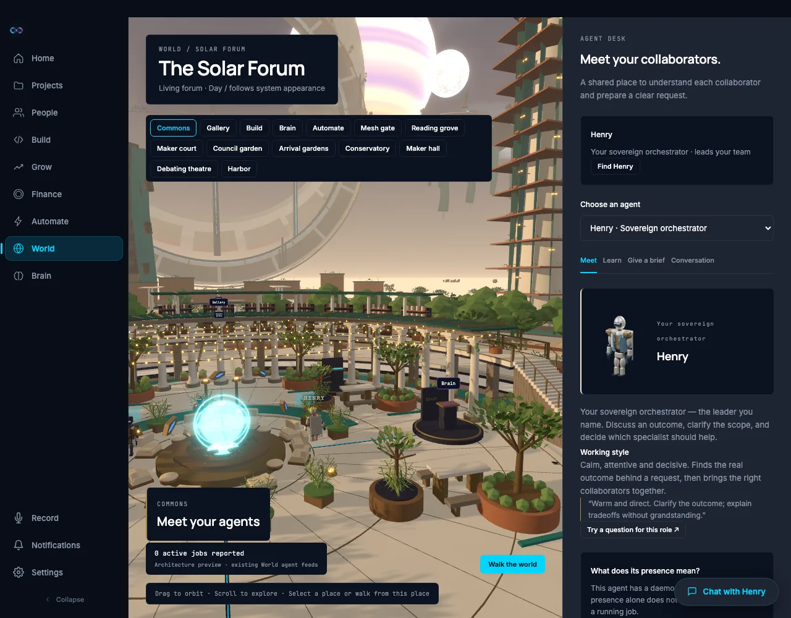
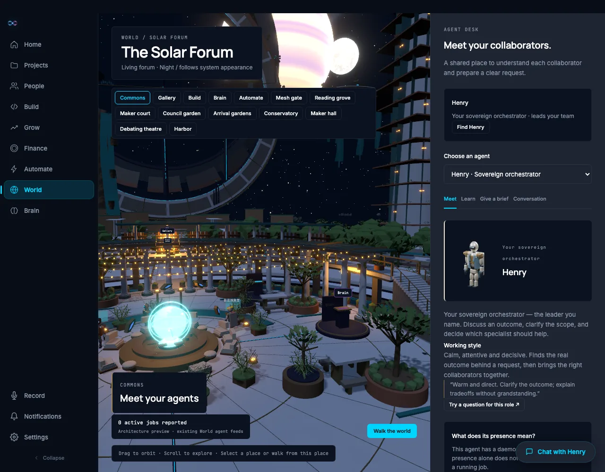

# The World's default vantage: a vista instead of an orbit (v4)

Date: 2026-09-15. Branch: `feat/solarpunk-forum` (clone `recovery/solar-forum`),
HEAD `7afc0787` at the start of the run, clean.

Job 19 (`jobs/19-night-recheck.md`) closed the night sky and the shadow work and
left two things open that are the whole of this job:

- **bug 4** — from the commons overlook, **0 of 4,056** tower window-strip
  vertices projected into the frame. `ForumNavigation.tsx:27` put that camera at
  `(29, 29, 36)` looking at `(0, 1, 0)` with a 48-degree field, which is a steep
  orbit of the paving: no tower, no ridge, no ring, no sky body is in it
  (`../../../../assets/world/forum/browser/v3-world-night.webp`).
- **bug 1** — both celestial bodies sat at the day sky's own luminance
  (luma ratios 0.98-1.16 across three vantages).

And one thing job 19 saw but did not name: the commons paving reads lavender at
night, where `north-star.png` is a deep blue night whose only warmth is the
emissives.

The north star (`../north-star.png`) is a low, wide vista from a terrace edge —
terrace and hologram globe in the foreground, water and structure in the middle,
ridge, rings, floating gardens and sky bodies behind. This job makes that the
World's default vantage, and measures what is actually in the frame instead of
asserting it.

Nothing was renamed, registered, approved or configured. **No chat message was
sent to the daemon**: the only daemon traffic was `GET /api/workspaces` and the
app's own polling. The daemon token is read from
`~/.permagent/secrets/daemon_token.json` and is never printed and never written
to the report.

## Commands run

```text
# dev server (from ui/command-center), stopped at the end of this job
npm run dev -- --host 127.0.0.1 --port 5284

# the new evidence harness (from ui/command-center)
node scripts/capture-vista-v4.mjs

# gates (from ui/command-center)
npm run typecheck
npx vitest run src/components/world
npm run build

# evidence shrink (PNG -> WebP, doc links rewritten), from the clone root
python3 scripts/blender/shrink-evidence.py
```

## What changed

### 1. The default and "Commons" vantage

New module `ui/command-center/src/components/world/forum/vistaCamera.ts` owns
the pose, and `ForumNavigation.tsx` and `ForumView.tsx`'s `<Canvas camera>` both
read it, so the app's first frame and the "Commons" district focus are the same
camera:

| | before | after |
| --- | --- | --- |
| position | `(29, 29, 36)` | **`(0, 10, 23)`** |
| target | `(0, 1, 0)` | **`(27, 1, -65)`** |
| vertical field | 48 deg (whole canvas) | **72 deg** (this pose only) |
| view axis | yaw **-38.9 deg** west of north, pitch **-31.2 deg** | yaw **+17.06 deg** east of north, pitch **-5.58 deg** |

Read back from the live camera in the running app:
`{"position":{"x":0,"y":10,"z":23},"fov":72,"yawDegEastOfNorth":17.057,"pitchDeg":-5.584}`
on a 702 x 972 canvas (aspect 0.7222).

Three numbers carry the design, and all three are forced:

- **Yaw +17 deg, not 0.** The two landmarks that have to share the frame sit
  about 51 degrees apart from this eye: the nearest NE spire (Blender
  `forum_towers.py:302`, three.js `(74, ., -58)`) is at azimuth **+42 deg**, and
  the ridge's eastern end — the Blender polar-100 arc, with its waterfall — is
  at **-8.5 deg**. Their bisector is +17, and it is the only axis that holds
  both.
- **72 degrees of vertical field, not 48.** With that 51-degree spread, the
  horizontal half-field has to be at least 26 degrees; the forum canvas inside
  the app is **portrait** (702 x 972, aspect 0.722), so 26 degrees horizontal is
  36 degrees vertical. 72 is that plus a working margin. The field is applied
  per pose, not to the canvas: every other district focus and walk mode are
  explicitly put back to 48, which is what they were framed for.
- **Eye at 10 m, not 6.** The Gallery's raised garden deck crosses the view at
  z = -20 and tops out near 9 m. From 6-7 m it closes off the entire middle
  distance; from 10 m the frame clears it. The brief asked for ~6; the frames at
  6-7 m are in this job's history and the deck fills them.

`OrbitControls` constrains this more than it looks: it clamps the polar angle to
`maxPolarAngle` (`Math.PI / 2.05` = 87.8 deg) on every `update()`, so the target
**must** sit below the eye or the pose is silently pulled back down on its first
frame. This one is at 84.4 deg.

### 2. The gas giant moved north

`ForumSky.tsx` had the gas giant on a **south-westerly** bearing (`bearing(-0.342,
0.940, 28)`), which is squarely behind a viewer of the new vantage. North is the
only side of the world that reads like the north star — ridge, rings, floating
gardens — so it is now `bearing(0.336, -0.942, 26.5)`: Blender polar **70.4
deg**, elevation 26.5, still clear of the ridge mesh (which exists only between
polar 100 and 215) and now inside the first orbital ring's hoop. The moon keeps
its own north-easterly bearing and sits to its right. The exact bearing is
composition rather than astronomy: due north put the disc behind the "The Solar
Forum" title card.

### 3. Day-sky parity

Job 19 bug 1 could not be fixed by brightening, and the reason is arithmetic:
day was a flat `ENV.marble` background behind warm haze, luma ~233 everywhere,
and an 8-bit frame caps a disc at 255 — a ratio of at most **1.09** against a
233 sky no matter what the shader does. So the sky had to come down as well as
the bodies going up. Three changes, all in `ForumSky.tsx`:

- a new `DaySky` gradient dome — warm `#FFE3BE` at the horizon to `#0B2454`
  overhead, mixed in three's linear working space with the exponent tuned so the
  24-30 degree band where both bodies hang lands near half the horizon's
  luminance, plus a soft warm bloom on the sunrise bearing;
- the cloud deck thinned from `smoothstep(.47,.7,n) * .78` to
  `smoothstep(.58,.86,n) * .46`. The plane sits at y = 105 over a 650 m square,
  so from terrace height it covers **every** sight line above about 17 degrees —
  which is exactly where the bodies are. It was painting over them;
- the shading floors raised: gas giant `base*(.78+.46*shade)` ->
  `base*(1.06+.56*shade)` with brighter belt tones (`#F8D6A4` / `#B295C6`), moon
  `base*(.84+.3*shade)` -> `base*(.95+.34*shade)`.

The radii are deliberately **not** changed: the in-app harnesses identify the
two bodies by sphere radius alone (`__celestialProbe`), so a resize would blind
them.

### 4. Night ground tint

`ForumLighting.tsx`'s night was a violet hemisphere sky over an **amber**
directional fill, and the two mixed on the pale paving into the lavender floor
of `v3-world-night.webp`.

| | before | after |
| --- | --- | --- |
| hemisphere sky | `#899CCB` | `#7FA0DE` |
| hemisphere ground | `ENV.darkStone` `#2A2A3E` | `#16233C` |
| key | `#B3C8FF` | `#A8C4FF` |
| fill | `ENV.neonAmber` `#FFB347` @ .35 | `#5C7FC6` @ .34 |

The warmth is where it belongs: the nine amber point lights — the lanterns, the
braziers, the strand lights — are untouched, and so are the emissives, which
take no light at all (`emissiveIntensity` is independent of every light in that
file, so nothing here can dim them).

## Results

### Landmarks in the frame

Read from the **live camera** in the running app, by projecting the sample table
in `ui/command-center/src/components/world/forum/vistaLandmarks.json` — whose
positions are converted from the Blender authoring scripts named in each row's
`source`. Full record: `../vista-frame-v4.json`.

| landmark | sample points in frame | nearest to centre (NDC) | distance |
| --- | --- | --- | --- |
| Hologram globe | **1 / 1** | (-0.57, -0.35) | 24 m |
| Lagoon | **6 / 9** | (0.19, -0.05) | 91 m |
| Council island | **3 / 3** | (-0.29, 0.02) | 117 m |
| NE spires | **2 / 7** | (0.93, 0.51) | 113 m |
| Ridge crest | **3 / 36** | (-0.93, 0.23) | 163 m |
| Ridge waterfalls | **2 / 6** | (-0.90, 0.01) | 141 m |
| Orbital ring 1 | **35 / 72** | (-0.14, 0.22) | 291 m |
| Orbital ring 2 | **33 / 72** | (-0.29, 0.31) | 420 m |
| Floating gardens | **2 / 4** | (0.54, 0.61) | 291 m |
| Gas giant | in frame | (0.07, 0.83), 128 px radius | 900 m |
| Moon | in frame | (0.47, 0.81), 35 px radius | 1080 m |
| South balustrade | 0 / 3 | (2.12, -1.39) | 14 m |
| West market habitats | 0 / 1 | behind the viewer (azimuth -93 deg) | 101 m |
| SE conservatory dome | 0 / 1 | behind the viewer (azimuth +132 deg) | 108 m |

Against job 19's "0 of 4,056 window-strip vertices, nearest cluster 102 m away
and ~48 degrees off axis": the spire cluster is now in frame at 113 m, and its
lit floors are legible in both captures. The same table is asserted offline in
`vistaCamera.test.ts` (jsdom, no WebGL) so a regression is a red test rather
than another screenshot.

**Three honest caveats, all geometry rather than lighting:**

1. The **west habitats and the SE conservatory dome cannot appear**. From a
   vantage on the south edge they are at azimuth -93 and +132 degrees — behind
   the viewer. No single frame holds them and the ridge and the spires; they are
   in the table so the measurement says so rather than leaving them unmentioned.
2. **In frame is not the same as visible.** The projection test has no
   occlusion. The lagoon's sample points project inside the canvas but the
   Gallery deck (top ~9 m at z = -20) stands in front of the water: the surface
   needs an eye above about 14 m, which is an overlook, not a terrace edge. The
   ridge crest, at 17 degrees of elevation, clears that deck and does read.
3. Only **3 of 36** ridge-crest samples and **2 of 7** spire samples are inside,
   both at their own edge of the frame. That is the 51-degree spread: the frame
   holds the near end of each, not the whole of either.




### Day and night sky, same camera

1280 x 1000, Google Chrome 152.0.7977.83 headless via Playwright, forum canvas
702 x 972 at dpr 1, `page.emulateMedia({ colorScheme })` flipping the scene live
(`Day / follows system appearance` -> `Night / follows system appearance`) with
**0.000 m** of camera movement between the pairs.

The World HUD — the title card and the district pills — is DOM painted over the
canvas, and both sky bodies sit behind it, so a disc sampled through it measures
the card. The overlay is hidden for the measurement frame only
(`v4-vista-day-sky`, `v4-vista-night-sky`); the two evidence frames above are
the app exactly as shipped.

| | body | disc / surround | ratio | target |
| --- | --- | --- | --- | --- |
| **day** | gas giant | 195.5 / 130.0 | **1.50** | >= 1.5 |
| **day** | moon | 253.7 / 167.3 | **1.52** | >= 1.5 |
| night | gas giant | 154.2 / 17.1 | **9.04** | job 19: 7.34 |
| night | moon | 253.7 / 105.2 | **2.41** | job 19: 13.17 (different camera) |

Job 19's day numbers to beat were **0.98-1.16**.

The same frames with every non-sky mesh hidden (job 19's occlusion technique,
172 meshes hidden by day and 142 at night) separate "the body reads against the
sky" from "something is standing in front of it":

| | body | disc / sky | ratio |
| --- | --- | --- | --- |
| day | gas giant | 227.7 / 140.0 | **1.63** |
| day | moon | 253.7 / 169.6 | **1.50** |
| night | gas giant | 227.6 / 11.1 | **20.53** |
| night | moon | 253.7 / 105.5 | 2.40 |

The gas giant's as-rendered day ratio is lower than its bare-sky ratio because
the first orbital ring genuinely crosses about a third of its disc — the same
kind of reading job 19 recorded for the ridge at the gate approach, and the
composition the north star has. The moon's night surround (105) is the lit ring
structure behind it, not sky.

### Night ground tint

Blue-minus-red is not the discriminator: the old lavender paving was
blue-dominant too. What made it lavender was red and green being **equal** under
that blue — a magenta component. Cool moonlight grades red < green < blue, so
green-minus-red is the number that separates them.

| frame | paving patch | mean RGB | green - red | blue - red |
| --- | --- | --- | --- | --- |
| `v3-world-night` (old lights) | x 260-500, y 690-800 | (99.8, 102.1, 120.8) | **+2.3** | +20.9 |
| `v3-world-night` (old lights) | x 600-880, y 740-840 | (94.4, 93.8, 109.2) | **-0.6** | +14.8 |
| `v4-vista-night` (new lights) | x 300-560, y 860-980 | (38.0, 46.9, 65.5) | **+8.9** | +27.4 |
| `v4-vista-night` (new lights) | x 620-880, y 880-980 | (70.0, 107.1, 138.9) | **+37.0** | +68.8 |

The harness's own canvas-wide paving band reads (69.9, 78.5, 98.6),
green-minus-red **+8.6**, blue-minus-red +28.8 at night, against (126.0, 113.7,
97.3) and green-minus-red **-12.2** in day — day is still the warm sunrise it was designed as, and only night
moved.

The emissives are unchanged by construction and unchanged in the pixels: the
strand lights, the lanterns, the braziers, the tower window strips and the
hologram globe all read as lit in `v4-vista-night.webp`, on a floor that is now
blue instead of pink.

### Orbit controls from the new start pose

Driven through the product's own input, after the captures (the evidence frames
are the untouched pose):

```json
"start":      { "position": {"x": 0, "y": 10, "z": 23}, "fov": 72,
                "yawDegEastOfNorth": 17.057, "pitchDeg": -5.584 }
"afterDrag":  { "position": {"x": 35.246, "y": 4.543, "z": 27.051}, "fov": 72,
                "yawDegEastOfNorth": -5.119, "pitchDeg": -2.195 }
"afterScroll":{ "position": {"x": 39.333, "y": 4.365, "z": 21.929}, "fov": 72 }
"restored":   { "position": {"x": 0.289, "y": 9.898, "z": 23.099}, "fov": 72,
                "yawDegEastOfNorth": 16.867, "pitchDeg": -5.521 }
"dragMovedCameraM": 35.9, "scrollMovedCameraM": 6.56,
"restoredWithinM": 0.32, "restoredFovMatches": true
```

Drag orbits (35.9 m of camera travel, yaw +17.06 -> -5.12 degrees), scroll dollies
(6.56 m), and leaving to another district and returning to the Commons puts the
camera back within **0.32 m** of the default vantage at the same field. The
residual is a pointer event landing on the canvas after the click, not a
different pose.

## Bugs and findings

**1 (P2, environment, root-caused and worked around here) — job 19's black
rectangle is an ANGLE *Metal* defect, not an intermittent one.** Job 19 bug 2
recorded a solid block of exact RGB 0,0,0 in the rendered frame, described it as
intermittent and "sticking to a camera pose", and worked around it by re-aiming.
On this pose it is not intermittent at all. Four browsers, same app, same frame:

| flags | pure-black pixels |
| --- | --- |
| `--use-angle=metal` | 67,447 at [595,28]-[909,310] |
| `--use-angle=metal --disable-gpu-rasterization` | 67,447, same rectangle |
| `--use-angle=metal --in-process-gpu` | 67,447, same rectangle |
| **`--use-angle=gl`** | **0** |

The same rectangle to the pixel across separate browser processes is a backend
defect, not a compositor race and not a page bug. `capture-vista-v4.mjs`
therefore drives the GL backend and every frame in this document was accepted
with 0 (day) and 7 (night) pure-black pixels on the first attempt. The
consequence: **this harness makes no frame-cost claim** — the GL backend is far
slower than the Metal one the product uses, and job 19's FPS numbers remain the
record. The report records its FPS under
`perfOnGlBackendNotComparable` so it cannot be quoted as one.

**2 (P3, product, open) — both sky bodies sit behind the World HUD.** The gas
giant's disc is 256 px across at the top of a 702 px canvas and the title card
and district pills cover the upper left of it. It is a reference-faithful look —
the north star also runs its headline across the sky — but a measurement has to
hide the HUD to get at the pixels, and a user cannot see about a third of the
planet. Moving the brand card or the district pills is a layout change this job
did not make.

**3 (P3, product, open) — the lagoon is not visible from any terrace-height
eye.** The Gallery's raised deck at z = -20 tops out near 9 m and screens the
water; the surface needs an eye above ~14 m. The default vantage shows the far
shore and the ridge above the deck but no water, where the north star's middle
distance is a lagoon. Either the deck or the vantage would have to move.

**4 (P3, measurement) — `vistaLandmarks.json`'s ridge crest heights are the
deterministic envelope only.** `forum_landform.py`'s `terrain_z` adds a fractal
noise term of up to +/-11 m that cannot be reproduced outside Blender, so the
crest sample heights are the peak-and-envelope part alone. At 180 m that is
+/-3.5 degrees of elevation, well inside the frame's vertical span, so it does
not change any in-frame verdict.

**5 (P4, docs, unchanged) — job 19 bug 9 is still open.** Every image link in
`jobs/11` through `jobs/18` is one `..` short. This document uses the correct
`../../../../assets/...` depth, as job 19 does.

## Console and network during the run

- **50 console errors**, every one `Failed to load resource ... 404`, from the
  same three endpoints job 19 recorded (`/api/coding-sessions/harness-runs`,
  `/api/browser/history`, `/api/browser/snapshot/{id}`). Pre-existing, unrelated.
- No page error originates from a `world/forum/*` module.
- The dev server started for this work was stopped at the end of the run.

## Files changed

```text
ui/command-center/src/components/world/forum/vistaCamera.ts        (new) the pose, the field, the projection
ui/command-center/src/components/world/forum/vistaLandmarks.json   (new) landmark sample table
ui/command-center/src/components/world/forum/vistaCamera.test.ts   (new) frame test, jsdom
ui/command-center/src/components/world/forum/ForumNavigation.tsx   commons vista + per-pose field
ui/command-center/src/components/world/forum/ForumView.tsx         Canvas opens on the vista
ui/command-center/src/components/world/forum/ForumSky.tsx          day sky dome, thinner cloud, brighter bodies, gas giant moved north
ui/command-center/src/components/world/forum/ForumLighting.tsx     cool night key/fill/ground
ui/command-center/src/components/world/forum/ForumWalk.tsx         walk keeps the 48-degree field
ui/command-center/src/components/world/forum/ForumNavigation.test.tsx
ui/command-center/src/components/world/forum/ForumSky.test.tsx
ui/command-center/scripts/capture-vista-v4.mjs                     (new) evidence harness
docs/design/solar-forum/vista-frame-v4.json                        (new) the record behind this document
assets/world/forum/browser/v4-vista-{day,night}.webp               (new) the app as shipped
assets/world/forum/browser/v4-vista-{day,night}-sky.webp           (new) HUD hidden, for the disc measurements
                                                                   (written as PNG, shrunk by scripts/blender/shrink-evidence.py)
```

## What this closes and what it does not

Closed:

- the default vantage and the "Commons" focus are the north star's low, wide
  vista, verified by projecting a landmark table through the live camera;
- job 19 bug 4 — the NE spires are in the default frame at 113 m, with their
  window strips legible at night;
- job 19 bug 1 — both bodies clear 1.5 against the day sky they hang in
  (1.50 and 1.52 as rendered, 1.63 and 1.50 against bare sky), and night is
  unchanged or better;
- the lavender night paving: green-minus-red moves from about 0 to +9 .. +37,
  with the emissives untouched;
- job 19 bug 2 root-caused to the ANGLE Metal backend, with a clean-frame
  workaround.

Still open:

- the sky bodies behind the World HUD (finding 2);
- the lagoon behind the Gallery deck (finding 3);
- the west habitats and the SE dome, which no south-edge vantage can hold;
- everything jobs 18 and 19 left open and this pass did not touch: an end-to-end
  agent reply (the `127.0.0.1:8081` transport), WKWebView render and FPS for the
  current export, the district-nav overflow at 1600 x 1000, and the job-11 list.

## Belvedere and raised eye (v5–v7)

Removing the upper stoa's north bays (a belvedere, bays 6–9) opened the sky
line but an eye at 10 m still skimmed the gallery balustrade
(`v5-vista-day.webp`). The vista pose is now eye (0, 15, 27), target
(30, 3, -76), 74° vertical field: the view clears the gallery and the
promenade groves, and the lakeside town and far shore read beyond them
(`v7-vista-day.webp`, `v7-vista-night.webp`). The day fog is a cool aerial
haze (`#B7C4D3`, density 0.0016) instead of the warm peach that had merged
the sunlit far ground into the sky. The harness's ray-occlusion probe reports
the far groups as "occluded-other" because it hits translucent mist and sky
batches first; the captures are the evidence, not that probe. Evidence:
`../../../../assets/world/forum/browser/v7-vista-day.webp`,
`../../../../assets/world/forum/browser/v7-vista-night.webp`,
`../vista-frame-v7.json`.
