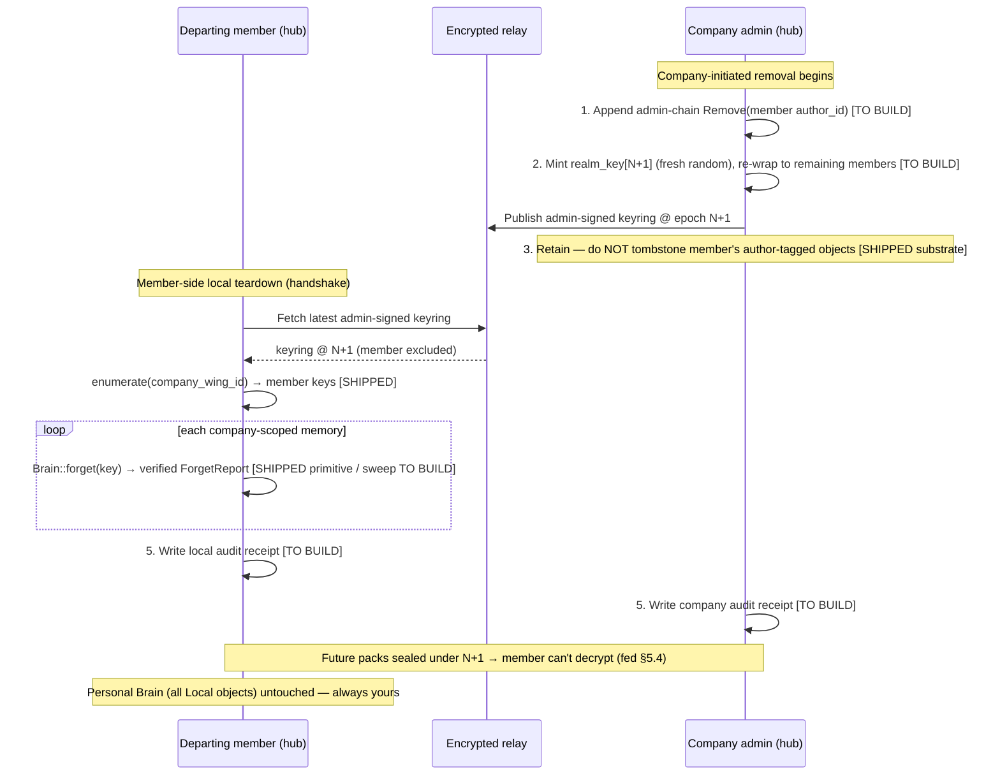

# Sovereign Offboarding — the clean-divorce federation model

> **Status: DESIGN — for review. No code is implemented by this document.**
> Design deliverable for **#850 (EPIC: Sovereign offboarding)**. This is the
> architecture for how a person leaves a company and keeps their **personal**
> agent/Brain while the company keeps its **proprietary** context — cleanly,
> both directions.
>
> **Audited against:** permagent-runtime `design/sovereign-offboarding` off
> `origin/main` @ `6fd47c19`; Spectral pin **`fb1038db`** (`Cargo.toml:88`).
> Every "current behaviour" claim below cites `file:line`. Claims are marked
> **[SHIPPED]** (verified in code at these pins), **[TO BUILD]** (this epic or
> its federation prerequisite), or **[ASSUMED]** (design intent, not yet in code).
>
> **Companion spec:** `docs/design/federation-security-spec.md` (#764, merged) —
> the identity/crypto/transport layer this flow rides on. Section refs like
> "(fed §5.4)" point there. This document does **not** re-specify crypto; it
> specifies the *offboarding orchestration* on top of it.

---

## 1. The scenario & why it's a differentiator

**The scenario.** Alice uses Permagent at Acme Corp for two years. Her agent
learns how she works, remembers her decisions, and also accumulates Acme's
proprietary context (architecture calls, internal roadmaps, code walkthroughs).
Alice leaves. What happens to two years of accumulated agent memory?

**The cloud-tenant model (what everyone else does).** On a cloud agent platform
(e.g. Opal / deployopal.com), the "personal" agent lives inside the company's
cloud tenant. On departure:

- **The employee gets nothing.** Their personal working context, preferences,
  and agent relationship were built inside the employer's account — they walk
  away empty-handed.
- **The company keeps everything** — including whatever *personal* context the
  employee built, because it never left the tenant.

Both directions are wrong: the person loses their personal agent; the company
retains personal data it has no claim to. Nobody's sovereignty is respected.

**The Permagent model (the inversion).** Permagent is local-first, scoped,
provenanced, and federated. That combination inverts the outcome:

- **The personal Brain was always yours** — it lives on your machine (fed §1,
  "the hub holds the person's Brain"). There is nothing to "extract" on
  departure; you already have it, and you keep it, smarter for the experience.
- **The company keeps exactly what you contributed** to its shared brain — no
  more, no less — because every shared object records *which brain authored it*
  (provenance, §2 below). Like commits staying in a repo you left.
- **Departure severs a federation link**, not a data-extraction fight. Revoke
  the member, rotate the shared key, and locally delete the company-scoped
  plaintext. Both sides end clean.

**One-liner:** *Leave with your agent. They keep their IP. No hostage data,
either direction.*

This "sovereign clean-divorce" is a flagship group/teams differentiator: it is
**structurally impossible** on a single-tenant cloud platform, and it falls out
naturally from primitives Permagent already ships (local Brain + content-addressed
provenance + scoped federation + verified forgetting).

---

## 2. The separation model — three axes that already exist

The clean divorce works because "your data" vs "the company's data" is not a
policy label bolted on at departure — it is drawn by **three orthogonal
primitives that exist in the codebase today**. Understanding that these are
*three different axes* (and are easy to conflate) is the crux of the design.

### 2.1 Axis A — Location: personal Brain (local) vs shared wing (federated) **[SHIPPED]**

- The **personal Brain** is the local SQLite substrate on your hub. It is yours
  by construction.
- A **shared wing** is a manifest of content-addressed object hashes that
  replicate between brains — "like a git tree references blobs"
  (`federation_sync.rs:1-17`). A memory that no shared-wing manifest references
  is **`Local` and structurally unexportable — the sovereignty guarantee**
  (`federation_sync.rs:14-15`; fed §2.1 guarantee **A**).
- Primitives shipped at pin `fb1038db`:
  `share(store, mem_key, wing_id)` (`federation_sync.rs:168`),
  `enumerate(store, wing_id) -> Vec<object_hash>` (`federation_sync.rs:189`),
  `export_pack` / `import_pack` (`federation_sync.rs:205,271`),
  `tombstone(wing_id, target_hash)` (`federation_sync.rs:362`),
  backed by the `shared_wing_members(wing_id, object_hash, mem_key, …)` and
  `sync_tombstones` tables (`federation_sync.rs:111-124`).
- **This axis is the offboarding boundary.** "Company-scoped" = a member of the
  company's shared wing(s). "Personal" = everything else, i.e. everything that
  stays `Local`.
- **Current usage: none.** No permagent crate calls `federation_sync` yet (grep
  of `crates/` for `federation_sync`/`export_pack`/`::share(` returns only
  `auth.rs` doc-comments). The *substrate* ships; the *wiring* does not.

### 2.2 Axis B — Visibility: the read-path scope filter **[SHIPPED, but orthogonal]**

- `Visibility` is a 4-level total order **`Private < Team < Org < Public`**
  (`spectral-core/src/visibility.rs:71-77`) with `allows(target)` = `self >=
  target` (`:87-89`). Default is `Private` (`:72`).
- This shapes **what a recall *returns*** for a given clearance — it is the
  honest-participant read filter (fed §2.1 guarantee **B**). It is **not** the
  export boundary and **not** a confidentiality barrier against a hostile local
  process (fed §2.1, "the overclaim to avoid").
- **Current usage: always `Private`.** Chat memories are written hardcoded
  `visibility: Visibility::Private` (`brain_ops.rs:143`). Nothing in permagent
  writes `Team`/`Org` today.
- **Do not conflate B with A.** An object can be `Visibility::Team` (surfaces in
  team recall) yet still `Local` (never exported), or vice-versa. Offboarding
  keys off **A (wing membership)**, not B. B is noted here precisely so the
  build does not accidentally use it as the boundary.

### 2.3 Axis C — Provenance: which brain authored each fact **[SHIPPED substrate]**

- Every shared object carries `author_id: Option<[u8; 32]>` — the 32-byte
  authoring `BrainId`, `None` for unsigned/legacy
  (`federation_sync.rs:30-31`). The author bytes are folded into the content
  address `object_hash` (`federation_sync.rs:68-76`), so authorship is
  tamper-evident by construction.
- Signed provenance verification ships: `Brain::verify_hit(hit, pubkey)`
  returns true only if the hit carries a signature + source-brain id whose key
  matches and whose signature validates over content-hash + created_at +
  visibility (`spectral-graph/src/brain.rs:900-924`), via
  `verify_memory_signature`. `brain_id()` / `verifying_key()` are exposed
  (`brain.rs:876,888`). Permagent already stamps `source_brain_id:
  *brain.brain_id()` on writes (`brain_handle.rs:433`).
- **Provenance is what lets the company retain your contributions.** Because
  each shared object is immutable, content-addressed, and author-tagged, the
  company's copy of the shared wing keeps exactly the objects you authored when
  you leave — nothing needs to be *copied out* of you; it is already theirs in
  the shared wing.
- **Current usage: `author_id` is effectively `None`.** Writes go through
  `RememberOpts` (`brain.rs:183-210`), which has no `author_id` field; the
  `federation_sync` `author_id` is populated only when objects are shared, which
  permagent does not do yet. The federation identity that *would* fill it
  (`FederationIdentity::author_id`, `auth.rs:306`) exists but is not yet bound
  to Brain writes.

### 2.4 The separation, stated

> **Your personal Brain** = every `Local` object on your hub (Axis A).
> Always yours; never exported; nothing to hand back.
>
> **The company's context** = the objects in the company's shared wing(s)
> (Axis A), each tagged with its author (Axis C).
> The company keeps its wing; you keep your local copy only until offboarding
> forgets it.

Everything in §3 is mechanics on top of this separation.

---

## 3. The offboarding flow

Departure is a **two-sided, orchestrated sequence**, not a single button on one
side — because no single party can do all of it (the admin cannot reach into the
departing member's local disk; the member cannot rotate the company's shared
key). The design is a handshake.

### 3.1 Step list

| # | Step | Actor | Primitive | Status |
|---|------|-------|-----------|--------|
| 1 | **Revoke member** — append an admin-chain `Remove` link naming the departing `author_id` | Company admin | admin-chain (fed §3.5) | **[TO BUILD]** — no `genesis`/`admin_chain` in code yet |
| 2 | **Rotate shared-wing key** — mint fresh-random `realm_key[N+1]`, re-wrap to *remaining* members only | Company admin | realm key + HPKE wrap (fed §5.4) | **[TO BUILD]** — no `realm_key`/`rotate`/`wrap` in code |
| 3 | **Retain contributions** — do **nothing** to the departed member's author-tagged objects in the shared wing | Company (default) | OR-Set immutability + `author_id` | **[SHIPPED substrate]** — retention is the *default*; objects persist unless explicitly tombstoned |
| 4 | **Local scope-forget** — enumerate the company wing's local members, then hard-delete each from the departing member's Brain | Departing member's hub | `enumerate(wing_id)` + `Brain::forget(key)` | **partial** — both primitives **[SHIPPED]**; the *sweep loop* + SafeBrain wrapper **[TO BUILD]** |
| 5 | **Audit record** — write a signed receipt of what was revoked / rotated / forgotten / retained, to both sides | Both hubs | — | **[TO BUILD]** |

### 3.2 Step 4 in detail — "scope-based forget" is a sweep, not a primitive

The issue frames offboarding as "scope-based `forget`, enabled by `Brain::forget`
(#835/#339)." **Precision matters here:** `Brain::forget` is **per-key**, not
per-scope.

- `Brain::forget(key: &str) -> ForgetReport` hard-deletes **one** memory across
  every substrate (memories row + FTS shadow, fingerprints, spectrogram,
  annotations, consolidation edges, co-retrieval pairs, retrieval-event refs,
  recognition sidecar), then **re-probes recall and recognition to verify it is
  gone** — "verified forgetting" (`spectral-graph/src/brain.rs:2064-2136`). The
  `ForgetReport::fully_forgotten()` gate keys off `store.existed && recall_clear
  && recognize_clear` (`brain.rs:138-143`).
- So a **scope-based forget** is: `enumerate(company_wing_id)` → resolve each
  `object_hash` to its local `mem_key` (the `shared_wing_members` table already
  stores that mapping, `federation_sync.rs:111-117`) → call `Brain::forget(key)`
  per member → aggregate the `ForgetReport`s into the audit record (Step 5).
  This loop is **[TO BUILD]** in permagent.
- **`Brain::forget` is not yet wired into permagent at all.** Grep of `crates/`
  for `.forget(` / `ForgetReport` returns nothing — `SafeBrain`
  (`brain_handle.rs`) has no `forget` method. Exposing verified-forget through
  the async `SafeBrain` handle is a prerequisite for the sweep and is **[TO
  BUILD]** (Phase 1 below — it needs no federation).
- **Known gap — graph triples survive `forget`.** `forget`'s own docs state:
  "Graph triples (from `assert`/`ingest_*`) are a separate provenance substrate
  keyed by entity/document, not by memory key, and are **not touched here**"
  (`brain.rs:2076-2078`). Company-derived *graph* facts (entities/relations
  asserted from proprietary material) are therefore **not** removed by the
  memory sweep. This is Open Question **Q2**.

### 3.3 Sequence diagram

### 3.4 Two initiators, two partial flows (Open Question Q7)

- **Company-initiated removal** (Alice is let go): admin does Steps 1–3 + 5
  immediately. Step 2's rotation cuts Alice's *future* access even if her hub
  never runs Step 4. Step 4 (local forget) then runs when her hub next comes
  online — or is enforced by policy/MDM, but a fully offline hub cannot be
  compelled (this is the honest limit, §5).
- **Member-initiated leave** (Alice quits): Alice runs Step 4 locally and
  requests Steps 1–2 from the admin. She *cannot* rotate the company key
  herself; she *can* prove her local forget via the receipt.
- Recommend a **two-sided handshake** so neither side depends on the other's
  good behaviour for its own guarantee: the admin's rotation is unilateral
  (cuts future access); the member's forget is unilateral (clears local
  plaintext); the audit record reconciles both.

---

## 4. The classification review — the fuzzy "derived knowledge" middle

Clean forgetting requires knowing *which memories are company-scoped*. Axis A
answers this crisply **when write-time scoping was done** — an object either is
or isn't in the company wing. The hard case is **derived knowledge**: "Did I
learn this generally (mine), or from Acme's proprietary code (theirs)?"

### 4.1 Why the middle is large *today* (and how to shrink it)

- **Today everything is `Local` + `Private` + `author_id = None`** (§2). There is
  no write-time company scoping at all (`brain_ops.rs:143`, `RememberOpts` has no
  wing/author binding). So *at present* **every** memory is ambiguous — there is
  no clean partition to fall back on.
- **The structural fix is write-time scoping**, not a smarter departure-day
  sort. When a memory is created inside a company project, stamp it into the
  company wing (`share(mem_key, wing_id)`) and set its author (`author_id`) at
  write time. Clean write-time scoping **shrinks the review to genuinely
  ambiguous derived facts** rather than the whole Brain. This is the single
  highest-leverage investment for making offboarding clean, and it is **[TO
  BUILD]** (the `RememberOpts` → wing/author binding).

### 4.2 The review pass — agent-proposes / human-confirms **[TO BUILD]**

For the residual ambiguous middle:

1. **Agent proposes a partition.** At offboarding (and ideally continuously), the
   agent classifies each un-scoped memory as `keep-personal` vs
   `leave-with-company`, using provenance hints (source doc, project context,
   entities referencing proprietary code) and a confidence score.
2. **Human confirms in batches.** The departing member reviews the proposed
   partition — accept-all, or correct individual items — before any forget runs.
   Ambiguous-derived items are surfaced, not silently deleted.
3. **The confirmed partition drives Steps 3–4** of the flow: confirmed
   `leave-with-company` items are shared into the company wing (if not already)
   and then forgotten locally; `keep-personal` items stay `Local`, untouched.

**Design stance:** the review is a *safety net for the gap*, not the primary
mechanism. The primary mechanism is clean write-time scoping; the review handles
what write-time scoping missed. As write-time scoping matures, the review pass
shrinks toward empty.

**The default-direction values call (Open Question Q5):** when the human doesn't
resolve an ambiguous item, does it default to `keep-personal`
(employee-favourable) or `leave-with-company` (employer-favourable)? This is a
product/legal decision, not a technical one — flagged, not decided.

---

## 5. Enforcement limits (honest)

The offboarding flow has a **cryptographic ceiling**. State it plainly; a buyer
and a departing employee will both probe it.

1. **Key rotation cuts *future* access, not past copies.** After Step 2, the
   removed member holds `realm_key[≤N]` and any plaintext they already synced —
   **this is not clawed back** (fed §2.3 non-goal #2; §5.4). They keep reaching
   the relay but receive only epoch-`N+1` ciphertext they cannot decrypt.
   Revocation is **forward-looking and eventually-consistent**, bounded by
   keyring propagation (fed §5.4 RT-4), not instantaneous.
2. **Local forget deletes local plaintext, verifiably — on a cooperating hub.**
   `Brain::forget` verifies deletion by re-probing recall + recognition
   (`brain.rs:2113-2128`). But this runs *on the member's own machine*. A member
   who has already exfiltrated (screenshot, copy-paste, a second tool reading the
   SQLite file directly) is a **DLP problem no system solves** — the same as any
   employee who ever had a laptop (fed §2.2, "compromised/stolen device… game
   over locally"; §2.1 guarantee **C**). Verified-forget defends the *honest*
   departure, not a hostile exfiltrator.
3. **Forget's substrate coverage is memory-keyed, not graph-keyed.** Graph
   triples survive (`brain.rs:2076-2078`, §3.2) — a real residual until Q2 is
   resolved.
4. **A fully offline removed hub cannot be compelled to forget.** Rotation still
   cuts its future access; its local plaintext persists until it runs Step 4.

**The claim to make:** *"clean, auditable offboarding"* — future access is
cryptographically cut, local plaintext is verifiably deleted on cooperating
hubs, and every action is recorded. **Never** claim *"unbreakable"* or *"we can
guarantee the ex-member retained nothing."* That would be the overclaim a
security-literate buyer catches immediately.

---

## 6. Dependencies & sequencing

### 6.1 What each side owns

**Spectral-side — already shipped at pin `fb1038db`:**

- `Visibility` read-scope filter (`visibility.rs`). **[SHIPPED]**
- `federation_sync` plaintext layer: `share`, `enumerate`, `export_pack`,
  `import_pack`, `tombstone`, OR-Set merge, the structural export gate
  (`federation_sync.rs`). **[SHIPPED]**
- `Brain::forget` verified per-key delete + `ForgetReport`
  (`brain.rs:2082,125`). **[SHIPPED]**
- `BrainId` provenance + `verify_hit` / `verify_memory_signature`
  (`brain.rs:900`; `spectral-core/identity`). **[SHIPPED]**
- *Possible Spectral ask:* an optional `forget_wing(wing_id)` convenience that
  loops `forget` over a wing's members atomically, and clarity on whether a
  graph-triple sweep belongs in Spectral (Q2). Not blocking — permagent can loop
  the shipped per-key `forget`.

**Permagent-side — the federation prerequisite (mostly [TO BUILD]):**

- `FederationIdentity` (Ed25519 + X25519, keyring-backed), `EncKeyCert`,
  `PeerRegistry`/`PeerRecord` TOFU pinning, `is_verified_wrap_target`,
  `safety_number` — **[SHIPPED]** in `crates/goose-server/src/auth.rs` (the
  former stub is filled: `auth.rs:219,415,532,561`).
- Realm **genesis + admin-chain** root of trust (fed §3.5). **[TO BUILD]**
- Realm **key + epochs + HPKE per-member wrapping + rotation** (fed §5).
  **[TO BUILD]**
- `seal_pack` / `open_pack` E2E + the authorship invariant (fed §4).
  **[TO BUILD]**
- **Transport / encrypted relay** (fed §6). **[TO BUILD]**
- Membership ops `add_member` / `remove_member` / `rotate` (fed §5, Appendix).
  **[TO BUILD]**
- **This epic's net-new, permagent-side:** the offboarding orchestration
  (Steps 1–5), the `SafeBrain::forget` wrapper + scope-forget sweep, the
  write-time wing/author binding on `RememberOpts`, the classification-review
  agent+UI, and the audit record. **[TO BUILD]**

### 6.2 The hard prerequisite

Steps 1–2 (revoke + rotate) are **downstream of the entire federation build**:
they require realm genesis, the admin-chain, realm keys, and multi-member E2E
sync — none of which exist in code yet. **Sovereign offboarding cannot ship
before federation identity + E2E multi-member sync (fed spec / #764) lands.**
Do not sequence this epic as if the primitives it revokes already exist; they
are themselves [TO BUILD].

### 6.3 Phased build order

- **Phase 0 — federation foundation (prerequisite epic, not this one).**
  Genesis + admin-chain, realm keys + rotation, seal/open pack, encrypted relay,
  `add_member`. Per the federation security spec. **Everything downstream gates
  on this.**
- **Phase 1 — local verified-forget slice (Spectral-independent; can start
  now).** Wrap `Brain::forget` in `SafeBrain`; build the `enumerate(wing) →
  forget` sweep against the *local* `shared_wing_members` table; write the audit
  record. Demonstrable with a single hub, no federation, no relay. This is the
  slice that de-risks the "verified forgetting" claim early.
- **Phase 2 — write-time scoping.** Bind `RememberOpts` → company wing +
  `author_id` at creation time (shrinks the classification middle, §4.1). Also
  Spectral-light (uses shipped `share`).
- **Phase 3 — revocation + rotation (needs Phase 0).** `remove_member` =
  admin-chain `Remove` link + fresh-random key rotation + re-wrap to remaining
  members.
- **Phase 4 — one-action offboarding orchestration.** Tie Steps 1–5 into the
  two-sided handshake (§3.4); UI surface for "leave company / remove member."
- **Phase 5 — classification review.** Agent-proposes / human-confirms partition
  for the residual derived-knowledge middle (§4.2).

Phases 1 and 2 are **available immediately** and carry most of the user-visible
"clean divorce" story locally; Phases 3–5 unlock the cross-person, cryptographic
half once federation lands.

---

## 7. Open questions / decisions for Jesse

- **Q1 — Boundary definition.** Is "company-scoped" defined **only** by
  shared-wing membership (Axis A), or does `Visibility::Team`/`Org` (Axis B) also
  imply company ownership? *Recommendation:* **wing membership is the sole
  authoritative offboarding boundary**; Visibility stays an orthogonal read
  filter. Using B as the boundary would be an error (it is a read-path filter,
  not an export/ownership boundary).

- **Q2 — Graph triples.** `Brain::forget` does not remove `assert`/`ingest`
  graph triples (`brain.rs:2076-2078`). Company-derived *graph* facts survive the
  memory sweep. Do we (a) build a parallel graph-scope forget, (b) ask Spectral
  to extend `forget` to cover graph provenance, or (c) accept the residual and
  document it? *Recommendation:* (b)/(a) before claiming full local forget; until
  then, disclose the residual.

- **Q3 — Terminology collision: "wing".** Federation `wing_id` (a *shared realm*,
  `federation_sync.rs`) and cognitive `RememberOpts.wing` (a *topical route* like
  `"permagent"`, `brain.rs:206-210`) are **different axes sharing one word**.
  This is an operator-error hazard in the offboarding UI and code. *Recommendation:*
  rename/namespace the federation id to `realm_id` in the permagent seam (fed
  §10.3 already maps `realm_id ≡ wing_id`) before building the flow.

- **Q4 — Default local-forget disposition.** On departure, do we **hard-delete**
  all company-wing local copies (strict, clean, verified) or **keep-but-mark**
  (retain for the member's own dispute/audit)? *Recommendation:* hard-delete with
  a signed receipt — the receipt is the audit trail, the plaintext is gone.

- **Q5 — Classification default direction.** For an ambiguous derived-knowledge
  item the human leaves unresolved, default to `keep-personal` (employee-favourable)
  or `leave-with-company` (employer-favourable)? A product/legal values call, not
  technical. *Flagged, not recommended* — Jesse's call.

- **Q6 — Contribution-retention vs right-to-retract.** The company retains the
  departed member's author-tagged contributions by default (§3, Step 3). But
  fed §7's tombstone policy is **author-only retraction + admin-quarantine** —
  an author *can* tombstone their own objects. May a departing member retract
  (tombstone) their own contributions before leaving, or is retention mandatory
  for company IP? Tension: individual authorship rights vs company IP retention.
  *Recommendation:* retention is the default; a pre-departure "retract mine"
  affordance is a product decision with the same weight as fed §7's hard-delete
  ruling.

- **Q7 — Initiator model.** Company-initiated removal vs member-initiated leave
  have different partial flows (§3.4) — neither party can perform the whole
  sequence. *Recommendation:* build the **two-sided handshake** so each side's
  guarantee is unilateral (admin rotation cuts future access; member forget
  clears local plaintext) and the audit record reconciles them.

- **Q8 — Enforcement posture on an offline removed hub.** Rotation cuts future
  access, but a member who never brings their hub online is never compelled to
  run local forget. Is a policy/MDM-enforced forget in scope, or do we accept the
  cryptographic-ceiling framing (§5) and document it? *Recommendation:* accept
  and document; do not claim enforcement we cannot cryptographically back.

---

## Appendix — primitive inventory (shipped vs to-build)

| Primitive | Where | Status |
|---|---|---|
| Structural export gate (`Local` unexportable) | `federation_sync.rs:14-15` | **[SHIPPED]** |
| `share` / `enumerate` / `export_pack` / `import_pack` / `tombstone` | `federation_sync.rs:168,189,205,271,362` | **[SHIPPED]** |
| `Visibility` read-scope filter (Private<Team<Org<Public) | `spectral-core/visibility.rs:71-89` | **[SHIPPED]** |
| `author_id` on shared objects (folded into content hash) | `federation_sync.rs:30-31,68-76` | **[SHIPPED]** |
| Signed provenance verify (`verify_hit`) | `spectral-graph/brain.rs:900-924` | **[SHIPPED]** |
| `Brain::forget` verified per-key delete + `ForgetReport` | `spectral-graph/brain.rs:2082,125-143` | **[SHIPPED]** |
| Federation identity (Ed25519+X25519), TOFU peer registry, wrap-target check | `goose-server/auth.rs:219,415,532` | **[SHIPPED]** |
| `SafeBrain::forget` wrapper + scope-forget sweep | — | **[TO BUILD]** (Phase 1) |
| Write-time wing/author binding on `RememberOpts` | — | **[TO BUILD]** (Phase 2) |
| Realm genesis + admin-chain root of trust | fed §3.5 | **[TO BUILD]** (Phase 0) |
| Realm key + epochs + HPKE wrap + rotation | fed §5 | **[TO BUILD]** (Phase 0) |
| `seal_pack` / `open_pack` E2E + authorship invariant | fed §4 | **[TO BUILD]** (Phase 0) |
| Encrypted relay transport | fed §6 | **[TO BUILD]** (Phase 0) |
| `remove_member` (admin-chain Remove + rotate) | fed §5, Appendix | **[TO BUILD]** (Phase 3) |
| Offboarding orchestration (Steps 1–5, two-sided handshake) | this doc §3 | **[TO BUILD]** (Phase 4) |
| Classification review (agent-proposes / human-confirms) | this doc §4 | **[TO BUILD]** (Phase 5) |
| Audit record | this doc §3 Step 5 | **[TO BUILD]** |
| Graph-triple scope forget (Q2 gap) | — | **[TO BUILD / open]** |

🤖 Generated with [Claude Code](https://claude.com/claude-code)
